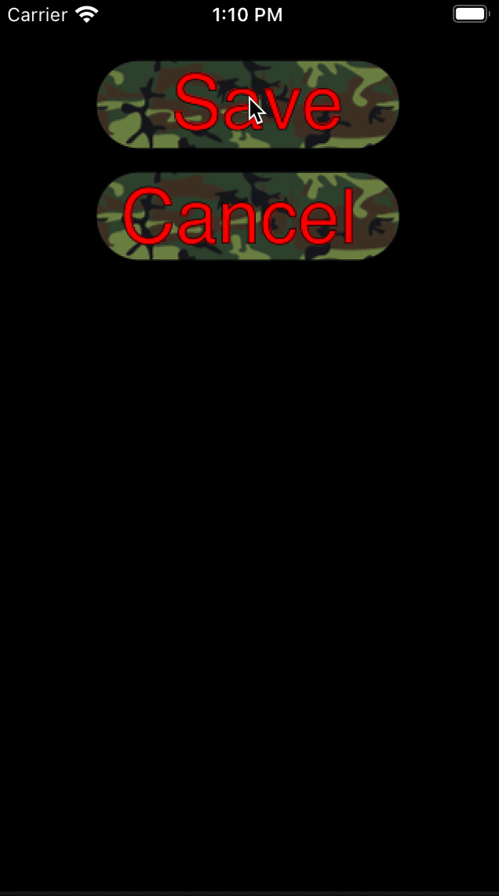

# Ein ImageView soll sich wie ein Button verhalten

## Aufgabe

<a></a>

## Ausführung

### Version 1

Die zweite Version ist besser, allerdings finde ich es interessant, in der ersten Version zu sehen, dass Observer aus SwiftUI auch in UIKit sinnvoll sein können.

Zunächst fügen wir im *Storyboard* zwei *ImageViews* mit passenden Bildern hinzu und und verbinden sie mit zwei *Outlets*: `saveImageView` und `cancelImageView`. Mit diesen *ImageViews* werden `ButtonFromImage`-Objekte erzeugt. `ButtonFromImage`-Objekte reagieren auf `touchesBegan`- und `touchesEnded`-Aufrufe des `ViewControllers`. Außerdem erhält das *ImageView* in `ButtonFromImage` einen `UITapGestureRecognizer`. So können die *ImageViews* darauf reagieren, wenn sie berührt und losgelassen wurden. Die beiden *Observer* sind übrigens unabhängig vom `UITapGestureRecognizer`: Zunächst setzen die Observer sie Skalierung des `ImageViews` fest. Wird das *Button* schließlich losgelassen, kann der `UITapGestureRecognizer` darauf reagieren.


```swift
import UIKit
import QuartzCore
import Combine

class ButtonFromImage: NSObject, CAAnimationDelegate {
    private let imageView: UIImageView
    private let touchesBeganObserver: AnyCancellable
    private let touchesEndedObserver: AnyCancellable
    private let completion: (() -> Void)?
    
    init(_ imageView: UIImageView,
         in viewController: ViewController,
         completion: (() -> Void)? = nil)
    {
        self.imageView = imageView
        self.completion = completion
        self.touchesBeganObserver = viewController.$beganTouches
            .sink(receiveValue: { touches in
                if let touch = touches.first, touch.view == imageView {
                    imageView.transform = CGAffineTransform(scaleX: 0.9, y: 0.9)
                }
            })
        self.touchesEndedObserver = viewController.$endedTouches
            .sink(receiveValue: { touches in
                if let touch = touches.first, touch.view == imageView {
                    imageView.transform = CGAffineTransform(scaleX: 1, y: 1)
                }
            })
        super.init()
        let tapGestureRecognizer = UITapGestureRecognizer(
            target: self,
            action: #selector(imageTapped(tapGestureRecognizer:)))
        self.imageView.addGestureRecognizer(tapGestureRecognizer)
        self.imageView.isUserInteractionEnabled = true
    }
    
    @objc func imageTapped(tapGestureRecognizer: UITapGestureRecognizer) {
        guard let image = tapGestureRecognizer.view as? UIImageView else {
            return
        }
        let keyframeAnimation = CAKeyframeAnimation(keyPath: "transform.scale")
        keyframeAnimation.keyTimes = [0.2, 0.4, 1.0]
        keyframeAnimation.values = [0.9, 1.2, 1.0]
        keyframeAnimation.duration = 0.3
        keyframeAnimation.delegate = self
//      keyframeAnimation.timingFunction = CAMediaTimingFunction(name: .easeOut)
        image.layer.add(keyframeAnimation, forKey: "pop")
        image.transform = CGAffineTransform(scaleX: 1, y: 1)
    }
    
    func animationDidStop(_ anim: CAAnimation, finished flag: Bool) {
        completion?()
    }

}

class ViewController: UIViewController {
    @IBOutlet weak var saveImageView: UIImageView!
    @IBOutlet weak var cancelImageView: UIImageView!
    @Published private(set) var beganTouches = Set<UITouch>()
    @Published private(set) var endedTouches = Set<UITouch>()
    
    var saveButton: ButtonFromImage?
    var cancelButton: ButtonFromImage?
    
    override func viewDidLoad() {
        super.viewDidLoad()
        self.saveButton = ButtonFromImage(saveImageView, in: self) { [weak self] in
            let alert = UIAlertController(title: "Saved",
                                          message: nil,
                                          preferredStyle: .alert)
            alert.addAction(UIAlertAction(title: "OK", style: .cancel))
            self?.present(alert, animated: true)
        }
        self.cancelButton = ButtonFromImage(cancelImageView, in: self) { [weak self] in
            let alert = UIAlertController(title: "Cancelled",
                                          message: nil,
                                          preferredStyle: .alert)
            alert.addAction(UIAlertAction(title: "OK", style: .cancel))
            self?.present(alert, animated: true)
        }
    }
    
    override func touchesBegan(_ touches: Set<UITouch>, with event: UIEvent?) {
        super.touchesBegan(touches, with: event)
        beganTouches = touches
    }
    
    override func touchesEnded(_ touches: Set<UITouch>, with event: UIEvent?) {
        super.touchesEnded(touches, with: event)
        endedTouches = touches
    }
}
```

## Diskussion

* Der *Button* reagiert nicht genauso wie ein `UIButton`: Wenn der *Button* z.B. zu lange gedrückt wird, wird kein *Tap* ausgelöst.
* Gezeigt wird, dass man mit `CAKeyframeAnimation` *Views* animieren kann.
* Mit `Published` Variablen, kann man Werteänderungen, ähnlich wie in SwiftUI, an *Subscriber* weitergeben. Alternativ hätte man auch ein `PassthroughSubject` verwenden können: [swiftbysundell](https://www.swiftbysundell.com/articles/building-custom-combine-publishers-in-swift/)

## Version 2:

Da `UIViews` wie `UIImageViews` ebenfalls `touchesBegan` und `touchesEnd` zum Überschreiben besitzen, lässt sich die vorherige Lösung verbessern. Auf `UITapGestureRecognizer` verzichten wir diesmal. Geachtet haben wir darauf, dass eine Aktion auch ausgelöst wird, wenn das Bild lange gedrückt wurde oder wenn der Finger zwischenzeitlich den Bildbereich verlassen hat und wieder in den Bildbereich zurückkehrt. Auch haben wir darauf geachtet, dass man nicht zwei Bilder gleichzeitig drücken kann.

```swift
import UIKit

extension UIImageView {
    var visibleImageRect: CGRect {
        guard let image = image,
              contentMode == .scaleAspectFit,
              image.size.width > 0 && image.size.height > 0 else {
            return bounds
        }

        let scale: CGFloat
        if image.size.width > image.size.height {
            scale = bounds.width / image.size.width
        } else {
            scale = bounds.height / image.size.height
        }

        let size = CGSize(width: image.size.width * scale, height: image.size.height * scale)
        let x = (bounds.width - size.width) / 2.0
        let y = (bounds.height - size.height) / 2.0

        return CGRect(x: x, y: y, width: size.width, height: size.height)
    }
}

class ImageButtonView: UIImageView, CAAnimationDelegate {
    private static var busyImageButtonView: ImageButtonView?

    private var touched = false {
        didSet {
            if touched {
                transform = CGAffineTransform(scaleX: 0.9, y: 0.9)
            } else {
                transform = CGAffineTransform.identity
            }
        }
    }
    
    private var targets = [() -> Void]()
    
    required init?(coder: NSCoder) {
        super.init(coder: coder)
        isUserInteractionEnabled = true
    }
        
    override func touchesBegan(_ touches: Set<UITouch>, with event: UIEvent?) {
        if Self.busyImageButtonView != nil { return }
        Self.busyImageButtonView = self
        if let location = touches.first?.location(in: self) {
            if visibleImageRect.contains(location) {
                touched = true
            }
        }
    }
    
    override func touchesEnded(_ touches: Set<UITouch>, with event: UIEvent?) {
        if Self.busyImageButtonView !== self { return }
        touched = false
        if let location = touches.first?.location(in: self) {
            if visibleImageRect.contains(location) {
                visualResponseOfFinishedTap()
                return
            }
        }
        Self.busyImageButtonView = nil
    }
    
    override func touchesMoved(_ touches: Set<UITouch>, with event: UIEvent?) {
        if Self.busyImageButtonView !== self { return }
        if let location = touches.first?.location(in: self) {
            if visibleImageRect.contains(location) {
                touched = true
            } else {
                touched = false
            }
        }
    }
    
    override func touchesCancelled(_ touches: Set<UITouch>, with event: UIEvent?) {
        if Self.busyImageButtonView !== self { return }
        touched = false
        Self.busyImageButtonView = nil
    }
    
    /// Add a scale-down-and-up animation with key: "pop" to its ImageView layer
    private func visualResponseOfFinishedTap() {
        let keyframeAnimation = CAKeyframeAnimation(keyPath: "transform.scale")
        keyframeAnimation.keyTimes = [0.2, 0.4, 1.0]
        keyframeAnimation.values = [0.9, 1.2, 1.0]
        keyframeAnimation.duration = 0.3
        keyframeAnimation.delegate = self
        keyframeAnimation.isRemovedOnCompletion = false
        keyframeAnimation.timingFunction = CAMediaTimingFunction(name: .easeOut)
        layer.add(keyframeAnimation, forKey: "pop")
        transform = CGAffineTransform(scaleX: 1, y: 1)
    }
    
    /// Add action to be executed after animations completion
    func addAction(_ action: @escaping () -> Void) {
        targets.append(action)
    }
    
    func animationDidStop(_ anim: CAAnimation, finished flag: Bool) {
        Self.busyImageButtonView = nil
        if anim === layer.animation(forKey: "pop") {
            layer.removeAnimation(forKey: "pop")
            executeCompletionHandlers()
        }
    }
    
    private func executeCompletionHandlers() {
        for target in targets {
            target()
        }
    }
}

class ViewController: UIViewController {
    @IBOutlet weak var saveButton: ImageButtonView!
    @IBOutlet weak var cancelButton: ImageButtonView!
    
    override func viewDidLoad() {
        super.viewDidLoad()
        cancelButton.addAction { [weak self] in
            let alert = UIAlertController(title: "Cancel",
                                          message: nil,
                                          preferredStyle: .alert)
            alert.addAction(UIAlertAction(title: "OK", style: .cancel))
            self?.present(alert, animated: true)
        }
        saveButton.addAction { [weak self] in
            let alert = UIAlertController(title: "Save",
                                          message: nil,
                                          preferredStyle: .alert)
            alert.addAction(UIAlertAction(title: "OK", style: .cancel))
            self?.present(alert, animated: true)
        }
    }
}
```
