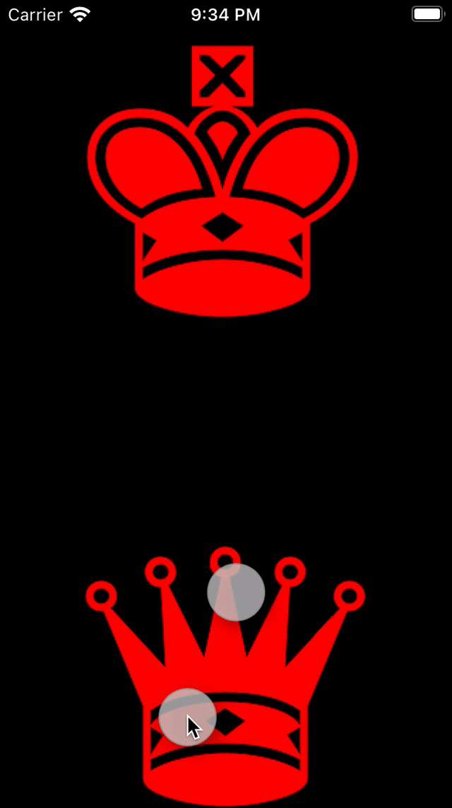

# Füge einem ImageView drei Gesten hinzu

## Aufgabe

<a></a>

## Ausführung

```swift
import UIKit

class ViewController: UIViewController {
    @IBOutlet weak var king: UIImageView!
    @IBOutlet weak var queen: UIImageView!
    
    override func viewDidLoad() {
        super.viewDidLoad()
        
        king.isUserInteractionEnabled = true
        queen.isUserInteractionEnabled = true
        
        let dragged = #selector(ViewController.dragged(dragGesture:))
        king.addGestureRecognizer(UIPanGestureRecognizer(target: self, action: dragged))
        queen.addGestureRecognizer(UIPanGestureRecognizer(target: self, action: dragged))
        
        let rotated = #selector(ViewController.rotated(rotationGesture:))
        king.addGestureRecognizer(UIRotationGestureRecognizer(target: self, action: rotated))
        queen.addGestureRecognizer(UIRotationGestureRecognizer(target: self, action: rotated))
        
        let pinched = #selector(ViewController.pinched(pinchGesture:))
        king.addGestureRecognizer(UIPinchGestureRecognizer(target: self, action: pinched))
        queen.addGestureRecognizer(UIPinchGestureRecognizer(target: self, action: pinched))
        
        // Let gestures perform simultaneously
        king.gestureRecognizers?.forEach { $0.delegate = self }
        queen.gestureRecognizers?.forEach { $0.delegate = self }
    }
    
    @objc func dragged(dragGesture: UIPanGestureRecognizer) {
        guard let gestureView = dragGesture.view else { return }
        
        switch dragGesture.state {
        case .began, .changed:
            let translation = dragGesture.translation(in: view)
            let endPoint = CGPoint(
                x: min(max(view.bounds.minX, gestureView.center.x + translation.x), view.bounds.maxX),
                y: min(max(view.bounds.minY, gestureView.center.y + translation.y), view.bounds.maxY))
            gestureView.center = endPoint
            dragGesture.setTranslation(.zero, in: view)
        // The translation should continue a little bit, after gesture finished
        case .ended:
            let translation = dragGesture.velocity(in: view)
            
            let endPoint = moveWithin(rectangle: view.bounds,
                                      from: CGPoint(x: gestureView.center.x,
                                                    y: gestureView.center.y),
                                      to: CGPoint(x: gestureView.center.x + translation.x / 8,
                                                  y: gestureView.center.y + translation.y / 8))
            UIView.animate(
                withDuration: 0.25,
                delay: .zero,
                options: [.curveEaseOut],
                animations: {
                    gestureView.center = CGPoint(x: endPoint.x, y: endPoint.y)
                })
        default:
            ()
        }
    }
    
    @objc func rotated(rotationGesture: UIRotationGestureRecognizer) {
        guard let gestureView = rotationGesture.view else { return }
        
        switch rotationGesture.state {
        case .began, .changed:
            gestureView.transform = gestureView.transform.rotated(
                by: rotationGesture.rotation)
            rotationGesture.rotation = .zero
        default:
            ()
        }
    }

    @objc func pinched(pinchGesture: UIPinchGestureRecognizer) {
        guard let gestureView = pinchGesture.view else { return }
        
        switch pinchGesture.state {
        case .began, .changed:
            gestureView.transform = gestureView.transform.scaledBy(
                x: pinchGesture.scale,
                y: pinchGesture.scale)
            pinchGesture.scale = 1
        default:
            ()
        }
    }
}

extension ViewController: UIGestureRecognizerDelegate {
    func gestureRecognizer(
        _ gestureRecognizer: UIGestureRecognizer,
        shouldRecognizeSimultaneouslyWith otherGestureRecognizer: UIGestureRecognizer)
    -> Bool {
        return true
    }
}

/**
 Move point `p1` within `rectangle` to `p2`. If `p2` is not inside `rectangle` return last point before leaving `rectangle`.
 - Parameter rectangle: The rectangle containing the moving points.
 - Parameter from: The point to start at. Inside `rectangle`.
 - Parameter to: The arrival point.
 - Returns: The arrival point within `rectangle`.
 */
func moveWithin(rectangle: CGRect, from p1: CGPoint, to p2: CGPoint) -> CGPoint {
    var endPoint = p2
    
    if endPoint.y > rectangle.maxY {
        let dx = endPoint.x - p1.x
        let dy = endPoint.y - p1.y
        endPoint.y = rectangle.maxY
        endPoint.x = p1.x + dx * (rectangle.maxY - p1.y) / dy
    }
    if endPoint.x > rectangle.maxX {
        let dx = endPoint.x - p1.x
        let dy = endPoint.y - p1.y
        endPoint.x = rectangle.maxX
        endPoint.y = p1.y + dy * (rectangle.maxX - p1.x) / dx
    }
    if endPoint.y < rectangle.minY {
        let dx = endPoint.x - p1.x
        let dy = endPoint.y - p1.y
        endPoint.y = rectangle.minY
        endPoint.x = p1.x + dx * (rectangle.minY - p1.y) / dy
    }
    if endPoint.x < rectangle.minY {
        let dx = endPoint.x - p1.x
        let dy = endPoint.y - p1.y
        endPoint.x = rectangle.minX
        endPoint.y = p1.y + dy * (rectangle.minX - p1.x) / dx
    }
    
    return endPoint
}
```
