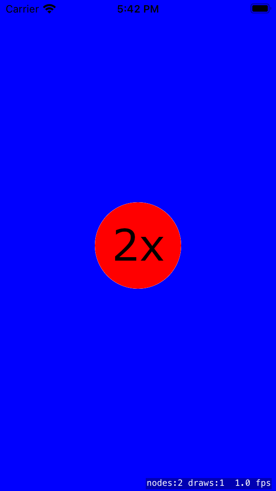
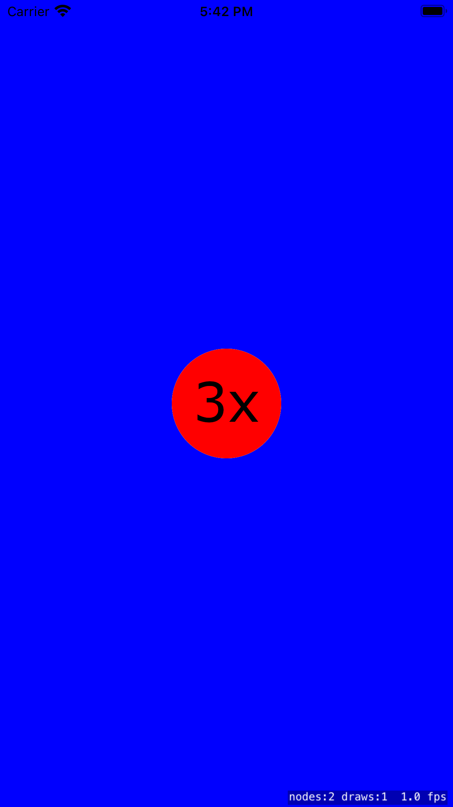
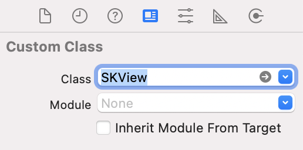
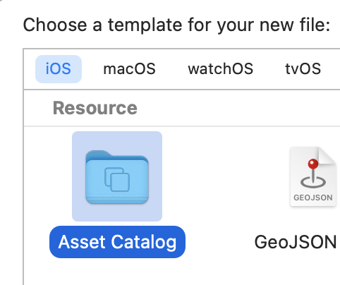
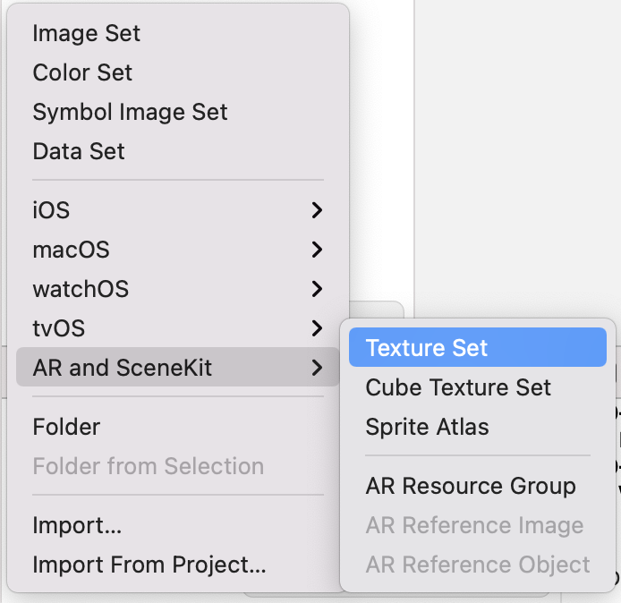
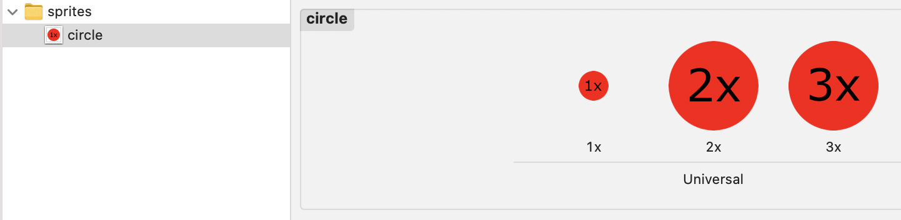

# 003 Sprite Atlas

## Aufgabe

Die *Sprites* sollen in einen *Texture Atlas* geschrieben werden, aber ein *Asset* soll dafür sorgen, dass es verschiedene Größen der *Sprites* passend zum Handy-Typ gibt.

<a></a>
<a></a>

## Umsetzung

* Stelle im Storyboard die Klasse des Views von *UIView* auf *SKView* um:
  
  <a></a>

* Erstelle eine neue Datei, z.B. *"SKAssets.xcassets"*:

  <a></a>
  
* Erstelle darin ein neues *Texture Set*:

  <a></a>
  
* Füge erst mal ein einzelnes Sprite in drei Versionen hinzu:

  <a></a>
  
  Eigentlich reichen *2x* und *3x*, da *1x* nur von wirklich alten Handys benutzt werden: [iOS Resolution](https://ios-resolution.com), [iOS Device Display Summary](https://developer.apple.com/library/archive/documentation/DeviceInformation/Reference/iOSDeviceCompatibility/Displays/Displays.html)
  
* *ViewController.swift*:

  ```swift
  import SpriteKit

  class ViewController: UIViewController {

      override func viewDidLoad() {
          super.viewDidLoad()
          if let spriteView = view as? SKView {
              spriteView.showsFPS = true
              spriteView.showsDrawCount = true
              spriteView.showsNodeCount = true
          }
      }

      override func viewWillAppear(_ animated: Bool) {
          let scene = TestScene()
          scene.size = view.bounds.size
          if let spriteView = view as? SKView {
              spriteView.presentScene(scene)
          }
      }

  }
  ```

* *TestScene.swift*:

  ```swift
  import SpriteKit

  class TestScene: SKScene {
      var contentCreated = false

      override func didMove(to view: SKView) {
          if contentCreated == false {
              createSceneContents()
              contentCreated = true
          }
      }

      func createSceneContents() {
          backgroundColor = .blue
          scaleMode = .aspectFit

          let atlas = SKTextureAtlas(named: "sprites")
          let texture = atlas.textureNamed("circle")
          let sprite = SKSpriteNode(texture: texture)
          if let spriteView = view {
              sprite.position = CGPoint(x: spriteView.bounds.width / 2,
                                        y: spriteView.bounds.height / 2)
              sprite.name = "myCircle"
              addChild(sprite)
          }
      }
  }
  ```
  
  ## Diskussion
  
  * Man kann auch das *Sprite* direkt erzeugen:
  
    ```swift
    let sprite = SKSpriteNode(imageNamed: "circle")
    ```
    
  * Wenn wir keine verschiedenen Versionen unserer *Sprites* benötigen, reicht es, wenn wir einen Ordner, der mit *.atlas* endet, zum Projekt hinzufügen und wir dort die Sprites unterbringen. Zu viele Sprites sollten wir jedoch nicht in einen einzelnen *Atlas*-Ordner legen, da ansonsten im Hintergrund mehrere *Textures* erzeugt werden müssten.
