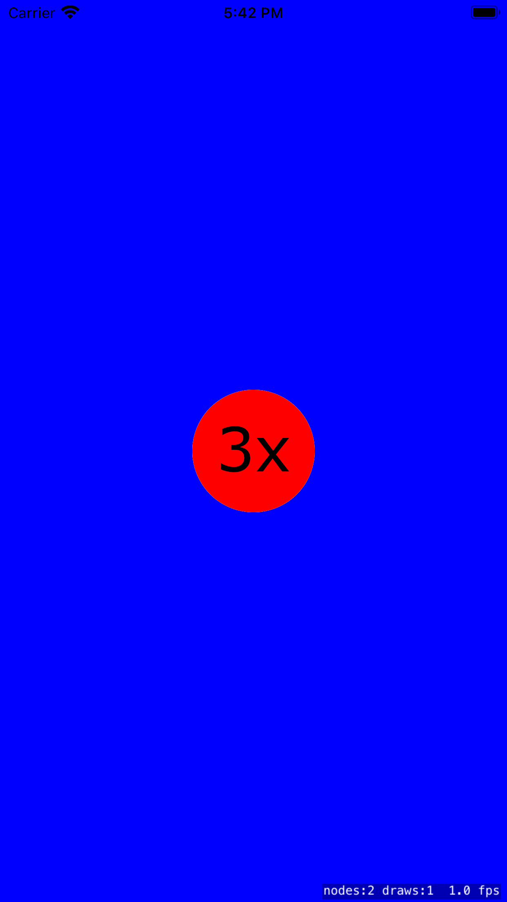

# 003 Sprite Atlas

## Aufgabe

Die *Textures* sollen in einen *Texture Atlas* geschrieben werden, aber ein *Asset* soll dafür sorgen, dass es verschiedene Größen der *Textures* passend zum Handy-Typ gibt.

## Umsetzung

