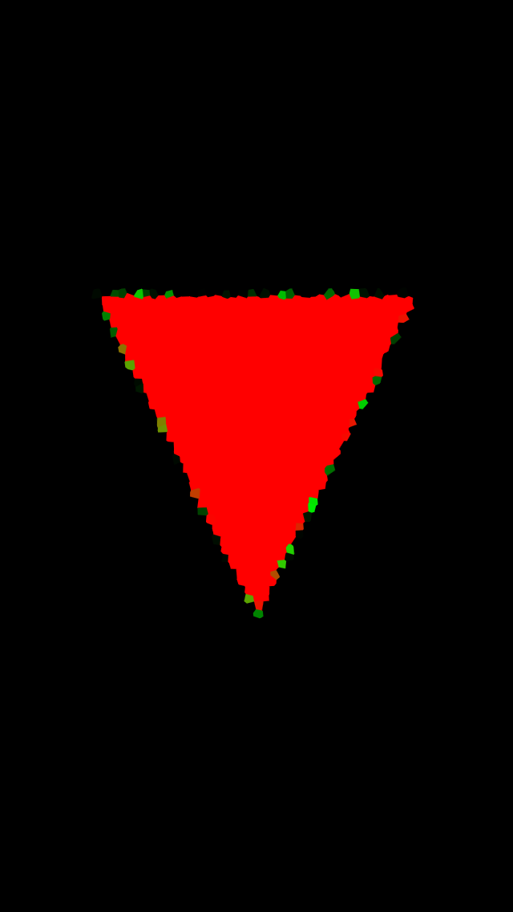

# UIBezierPath und CIFilter

## Aufgabe

Zeichne ein Dreieck und wende einen Filter darauf an.

<a></a>

## Ausführung

```swift
import SpriteKit

class ViewController: UIViewController {

    override func viewDidLoad() {
        super.viewDidLoad()
    }
    
    override func viewWillAppear(_ animated: Bool) {
        let scene = TestScene()
        scene.size = view.bounds.size
        if let spriteView = view as? SKView {
            spriteView.presentScene(scene)
        }
    }
}

class TestScene: SKScene {
    var contentCreated = false
    
    override func didMove(to view: SKView) {
        if contentCreated == false {
            createSceneContents()
            contentCreated = true
        }
    }
    
    func createSceneContents() {
        guard let spriteView = view else { return }
        backgroundColor = .black
        scaleMode = .aspectFit
        
        let triangle = UIBezierPath()
        triangle.move(to: CGPoint(x: 0, y: -100))
        triangle.addLine(to: CGPoint(x: -100, y: 100))
        triangle.addLine(to: CGPoint(x: 100, y: 100))
        triangle.close()
        
        let shape = SKShapeNode(path: triangle.cgPath)
        shape.strokeColor = .green
        shape.fillColor = .red
        shape.position = CGPoint(x: spriteView.bounds.width / 2,
                                 y: spriteView.bounds.height / 2)
        
        let effect = SKEffectNode()
        guard let filter = CIFilter(name: "CICrystallize") else {
            fatalError()
        }
        filter.setValue(10, forKey: "inputRadius")
        effect.filter = filter
        effect.addChild(shape)
        addChild(effect)
    }
}
```

## Diskussion

Eine Übersicht über alle Filter findet man auf [CoreImageFilterReference](https://developer.apple.com/library/archive/documentation/GraphicsImaging/Reference/CoreImageFilterReference/index.html)
