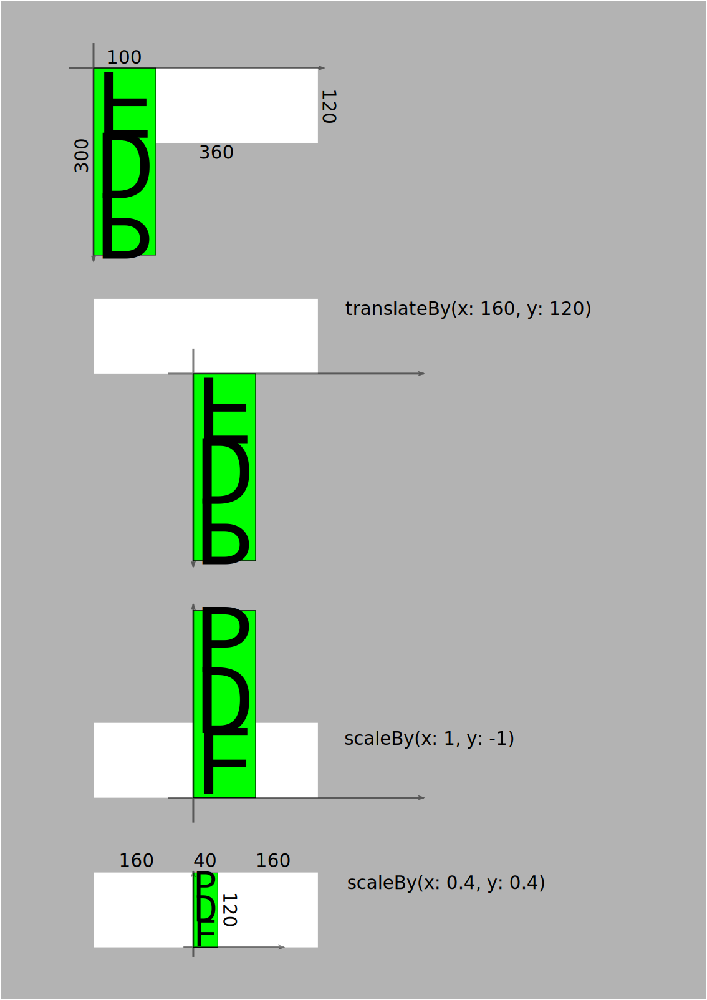

# PDF to Image

## Aufgabe:

Wir haben eine Vectorgrafik der Größe 300 x 100 (beliebige Einheit) als PDF gespeichert und wollen sie nun in ein `UIImage` der Größe 360 pt x 120 pt laden. Da das Ziel (`UIImage`) andere Seitenverhältnisse als die Quelle (PDF) hat, reicht eine einfache Skalierung nicht aus. Wir wollen, dass das Quellbild möglichst groß und zentriert dargestellt wird, ohne Ränder abzuschneiden oder das Bild zu verzerren. Das entspricht `UIView.ContentMode.scaleAspectFit`. Da die positive Y-Achse von Core Graphics von oben (Ursprung) nach unten verläuft und die positive Y-Achse von PDF-Dateien von unten (Ursprung) nach oben verläuft, muss das Bild außerdem gespiegelt werden.

<a></a>

## Ausführung

```swift
import UIKit

extension UIImage {
    /**
     Render PDF into UIImage using a mode similar to *UIView.ContentMode.scaleAspectFit*.
     - Parameter url: The URL of the PDF-file.
     - Parameter destination: The size of the resulting image.
     - Parameter background: If specified, the background color of the transparent areas.
     */
    static func fromPDF(url: URL, atSize size: CGSize, background: UIColor = .clear) -> UIImage? {
        guard let document = CGPDFDocument(url as CFURL),
              let documentPage = document.page(at: 1) else {
            return nil
        }
        let page = documentPage.getBoxRect(.mediaBox)
        let scale = min(size.width / page.width, size.height / page.height)
        let renderer = UIGraphicsImageRenderer(size: size)
        let image = renderer.image {context in
            background.set()
            let drawingRect = CGRect(origin: CGPoint(x: 0, y: 0), size: size)
            context.fill(drawingRect)
            
            context.cgContext.translateBy(
                x: (size.width - page.width * scale) / 2,
                y: (size.height + page.height * scale) / 2)
            
            context.cgContext.scaleBy(x: 1, y: -1)
            context.cgContext.scaleBy(x: scale, y: scale)
            
//          or the other way around:
//          context.cgContext.scaleBy(x: scale, y: -scale)
//          context.cgContext.translateBy(
//              x: (size.width / scale - page.width) / 2,
//              y: -(page.height + size.height / scale) / 2)

            context.cgContext.drawPDFPage(documentPage)
        }
        
        return image
    }
}

class ViewController: UIViewController {

    override func viewDidLoad() {
        super.viewDidLoad()
        view.backgroundColor = .blue
        
        guard let path = Bundle.main.path(forResource: "klf", ofType: "pdf") else {
            fatalError()
        }
        let url = URL(fileURLWithPath: path)
        let size = CGSize(width: 360, height: 120)
        
        let image = UIImage.fromPDF(url: url, atSize: size, background: .cyan)
        let imageView = UIImageView(image: image)
        
        imageView.center = CGPoint(x: view.bounds.width / 2, y: view.bounds.height / 2)
        view.addSubview(imageView)
    }
}
```

## Diskussion

[Quartz 2D Programming Guide](https://developer.apple.com/library/archive/documentation/GraphicsImaging/Conceptual/drawingwithquartz2d/Introduction/Introduction.html)
