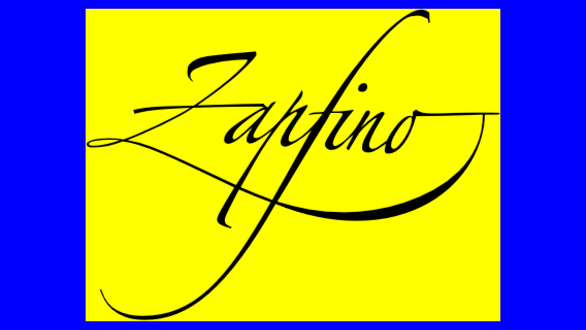

# String als Bild ohne Ränder

## Aufgabe

<a></a>

## Ausführung

```swift
import UIKit

class ViewController: UIViewController {

    override func viewDidLoad() {
        super.viewDidLoad()
        view.backgroundColor = .blue
        let font = UIFont(name: "Zapfino", size: 65)!
        let text = NSAttributedString(string: "Zapfino",
                                      attributes: [NSAttributedString.Key.font: font])
        let image = UIImage(singleLine: text)
        let imageView = UIImageView(image: image)
        imageView.backgroundColor = .yellow
        imageView.center = view.center
        view.addSubview(imageView)
    }

}

extension UIImage {
    /**
     Create an UIImage without margins.
     - Parameter singleLine: Single line of NSAttributedString or NSMutableAttributedString. May
     consists of multiple fonts.
     */
    convenience init(singleLine: NSAttributedString) {
        let stringImage = AttributedStringWrapper(singleLine: singleLine)
        if let stringImage = stringImage, let image = stringImage.image {
            self.init(cgImage: image)
        } else {
            self.init()
        }
    }
    
}

/**
 Wrapper for a single line NSAttributedString to create an Image with no margins.
 */
class AttributedStringWrapper {
    
    private enum CTFrameError: Error {
        case fatal(String)
    }
    
    private let string: NSAttributedString
    private var croppingBounds = CGRect()
    private let canvas: CGRect
    
    init?(singleLine: NSAttributedString) {
        self.string = singleLine
        let initialBounds = singleLine.boundingRect(
            with: .zero,
            options: NSStringDrawingOptions.usesLineFragmentOrigin,
            context: nil)
        self.canvas = Self.increaseBoundsForSpecialFonts(bounds: initialBounds)
        self.croppingBounds = canvas
    }
    
    /// Fonts like Zapfino need some extra space
    static private func increaseBoundsForSpecialFonts(bounds: CGRect) -> CGRect {
        // trial and error:
        let newSize = CGSize(width: bounds.width + bounds.height,
                             height: 1.5 * bounds.height)
        return CGRect(origin: bounds.origin, size: newSize)
    }
    
    /**
     Get the attributed text as image with margins cut off.
     */
    var image: CGImage? {
        UIGraphicsBeginImageContext(croppingBounds.size)
        guard let context = UIGraphicsGetCurrentContext() else {
            return nil
        }
        do {
            try drawToBottomLeftCanvasCorner(in: context)
        } catch {
            print(error)
            return nil
        }
        let cgImage = UIGraphicsGetImageFromCurrentImageContext()?.cgImage
        UIGraphicsEndImageContext()
        let croppedImage = cgImage?.cropping(to: croppingBounds)
        return croppedImage
    }
    
    /**
     Draw the attributed string into context while adjusting the cropping bounds to content.
     */
    private func drawToBottomLeftCanvasCorner(in context: CGContext) throws {
        context.addRect(croppingBounds)
        flipCoordinatesVertical(context: context)
        let ctFrame = createCTFrame()
        try moveToBottomLeftCorner(context, ctFrame)
        CTFrameDraw(ctFrame, context)
    }
    
    private func flipCoordinatesVertical(context: CGContext) {
        context.textMatrix = .identity // reset textMatrix
        context.translateBy(x: 0, y: croppingBounds.height)
        context.scaleBy(x: 1, y: -1)
    }
    
    private func createCTFrame() -> CTFrame {
        let framesetter = CTFramesetterCreateWithAttributedString(string)
        let path = CGMutablePath()
        path.addRect(croppingBounds)
        let ctFrame = CTFramesetterCreateFrame(framesetter,
                                               CFRange(),
                                               path,
                                               nil)
        return ctFrame
    }
    
    /**
     Move contexts coordinate system to ensure that the text isn't cropped up above or to the left.
     */
    private func moveToBottomLeftCorner(_ context: CGContext, _ ctFrame: CTFrame) throws {
        try boundsToTextBounds(context, ctFrame)
        context.translateBy(x: -croppingBounds.origin.x, y: -croppingBounds.origin.y)
        changeBoundsOriginToFitUIViewCoordinates()
    }
    
    /**
     Calculate the cropping bounds of the text. The origin of the cropping rectangle is its bottom left corner.
     Its coordinates are measured from the bottom left corner of the enclosing canvas rectangle.
     */
    private func boundsToTextBounds(_ context: CGContext, _ ctFrame: CTFrame) throws {
        guard let lines = CTFrameGetLines(ctFrame) as? [CTLine],
              let firstLine = lines.first else {
            throw CTFrameError.fatal("Could not get lines of CTFrame")
        }
        let boundsInLineCoordinates = CTLineGetImageBounds(firstLine, context)
        
        var origins = [CGPoint](repeating: .zero, count: lines.count)
        CTFrameGetLineOrigins(ctFrame, CFRange(), &origins)
        guard let firstOrigin = origins.first else {
            throw CTFrameError.fatal("Could not get origins of CTFrame")
        }
        
        // One extra pixel to prevent dropped pixels:
        let originOfBounds = CGPoint(
            x: firstOrigin.x + boundsInLineCoordinates.origin.x - 1,
            y: firstOrigin.y + boundsInLineCoordinates.origin.y - 1
        )
        let size = CGSize(
            width: boundsInLineCoordinates.width + 1,
            height: boundsInLineCoordinates.height + 1)
        
        croppingBounds = CGRect(origin: originOfBounds, size: size)
    }
    
    /**
     The origin of the bounds is its bottom left corner. In the current context, the reference point to the origin
     is the bottom left corner of the canvas. In the UIView, the reference point will be the **top** left corner
     of the canvas.
     */
    private func changeBoundsOriginToFitUIViewCoordinates() {
        croppingBounds.origin = CGPoint(x: 0, y: canvas.height - croppingBounds.height)
    }
}
```

## Diskussion

Statt `let boundsInLineCoordinates = CTLineGetImageBounds(firstLine, context)` ginge auch:

```swift
let boundsInLineCoordinates = CTLineGetBoundsWithOptions(
    firstLine,
    [CTLineBoundsOptions.useGlyphPathBounds])
```

Dann werden die Koordinaten auch nicht gerundet und könnten möglicherweise präziesere Ergebnisse liefern???
