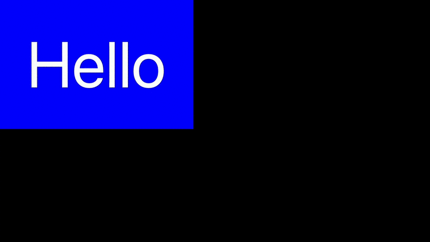

# Flip Views from left to right

## Aufgabe:

Wir haben zwei Label-Views, nur eines davon ist jeweils sichtbar. Wird der Bildschirm berührt, sollen die beiden Views über eine Rotation von links nach rechts ihre Plätze tauschen. Zunächst die konventionelle Lösung:

```swift
import UIKit

class ViewController: UIViewController {
    static let frame = CGRect(x: 0, y: 0, width: 300, height: 200)
    let view1: UIView = {
        let label = UILabel(frame: frame)
        label.text = "Hello"
        label.textAlignment = .center
        label.font = UIFont.systemFont(ofSize: 100)
        return label
    }()
    let view2: UIView = {
        let label = UILabel(frame: frame)
        label.text = "World"
        label.textAlignment = .center
        label.font = UIFont.systemFont(ofSize: 100)
        return label
    }()
    var currentView: UIView!

    override func viewDidLoad() {
        super.viewDidLoad()
        view1.backgroundColor = .blue
        view2.backgroundColor = .red
        let viewContainer = UIView(frame: Self.frame)
        view.addSubview(viewContainer)
        currentView = view1
        viewContainer.addSubview(currentView)
    }
    
    override func touchesBegan(_ touches: Set<UITouch>, with event: UIEvent?) {
        if currentView == view1 {
            flip(to: view2)
        } else {
            flip(to: view1)
        }
    }
    
    func flip(to toView: UIView) {
        UIView.transition(from: currentView,
                          to: toView,
                          duration: 1,
                          options: .transitionFlipFromLeft,
                          completion: { _ in self.currentView = toView })
    }

}
```

Nun wollen wir eine ähnliche Animation über Core Animation erstellen:

```swift
func flip(to toView: UIView) {
    flipTransition(from: currentView,
                   to: toView,
                   duration: 1,
                   completion: { self.currentView = toView })
}

var locked = false
func flipTransition(from fromView: UIView,
                    to toView: UIView,
                    duration: TimeInterval,
                    completion: (() -> Void)? = nil) {
    ???
}
```

<a></a>

Implementiere `flipTransition`.

## Ausführung

```swift
var locked = false
func flipTransition(from fromView: UIView,
                    to toView: UIView,
                    duration: TimeInterval,
                    completion: (() -> Void)? = nil) {
    if locked { return }
    locked = true
    let disappearing = yRotationAnimation(into: fromView,
                                          fromAngle: 0,
                                          toAngle: .pi / 2,
                                          duration: duration / 2)
    disappearing.timingFunction = CAMediaTimingFunction(name: .easeIn)

    let appearing = yRotationAnimation(into: toView,
                                       fromAngle: -.pi / 2,
                                       toAngle: 0,
                                       duration: duration / 2)
    appearing.timingFunction = CAMediaTimingFunction(name: .easeOut)

    CATransaction.begin()
    CATransaction.setCompletionBlock {

        CATransaction.begin()
        CATransaction.setCompletionBlock {
            toView.layer.removeAnimation(forKey: "appearing")
            toView.layer.transform = CATransform3DIdentity
            if let completion = completion {
                completion()
            }
            self.locked = false
        }
        fromView.superview?.addSubview(toView)
        fromView.layer.removeAnimation(forKey: "disappearing")
        fromView.removeFromSuperview()
        toView.layer.add(appearing, forKey: "appearing")

        CATransaction.commit()
    }
    fromView.layer.add(disappearing, forKey: "disappearing")

    CATransaction.commit()
}

func yRotationAnimation(into rotationView: UIView,
                        fromAngle: CGFloat,
                        toAngle: CGFloat,
                        duration: TimeInterval) -> CABasicAnimation {
    let rotation = CABasicAnimation(keyPath: "transform.rotation.y")
    rotation.duration = duration
    rotation.fromValue = fromAngle
    rotation.toValue = toAngle
    rotation.fillMode = .forwards
    rotation.isRemovedOnCompletion = false

    var transform = CATransform3DIdentity
    transform.m34 = -1 / 400
    transform = CATransform3DRotate(transform, fromAngle, 0, 1, 0)
    rotationView.layer.transform = transform

    return rotation
}
```

## Diskussion

* `var locked` soll verhindern, dass die Animation während ihrer Ausführung erneut aufgerufen wird.

* `func yRotationAnimation` erzeugt nicht nur eine Animation sondern setzt auch gleich die Transformation des dazugehörigen Views auf den Anfangswert. Sonst würde beim `addSubview` kurz das untransformierte View angezeigt, bevor dessen Animation beginnt.

* `.fillMode = .forwards` und `.isRemovedOnCompletion = false` verfolgen ein gemeinsames Ziel: Zu verhindern, dass am Ende der Animation kurz das View in seinem Zustand vor der Animation angezeigt wird.

* `fromView.layer.removeAnimation` und `toView.layer.removeAnimation` sind notwendig, da sie ansonsten zukünftige Animationen überlagern. Wir erinnern uns: Wir hatten den Animationen mit `.isRemovedOnCompletion = false` den Befehl gegeben, sich nach ihrer Beendigung nicht automatisch zu entfernen, daher müssen wir die Animation nun selber explizit entfernen.

## Version 2

Ich finde die verschachtelten `CATransaction.begin`-`CATransaction.commit`-Blöcke nicht besonders schön. Je mehr Animationen zu einer einer einzelnen zusammengesetzt werden, desto fehleranfälliger wird es. Die folgende Version ist zwar länger, lässt sich aber besser erweitern.

```swift
import UIKit

func flipTransition(from fromView: UIView,
                    to toView: UIView,
                    duration: TimeInterval,
                    completion: (() -> Void)? = nil) {
    guard let superview = fromView.superview else {
        return
    }
    TransactionAnimation.perform(
        fromView.disappearFromLeftToMiddle(duration: duration / 2),
        toView.appearFromMiddleToRight(duration: duration / 2, in: superview),
        in: superview,
        finishWith: completion)
}

/**
 - Parameter run: Prepare and run the animation.
 - Parameter completion: Set state after animation is finished.
 */
struct TransactionAnimation {
    let run: () -> Void
    let completion: () -> Void
}

extension TransactionAnimation {
    private static var performingSuperviews = Set<UIView>()
    
    /**
     - Parameter animations: `TransactionAnimations` to be performed one after another.
     - Parameter view: `superview` of the animated views. Calls are refused during animation.
     - Parameter trailer: The completion block to be performed after all animations are finished.
     */
    static func perform(_ animations: TransactionAnimation...,
                        in view: UIView,
                        finishWith trailer: (() -> Void)? = nil) {
        guard !performingSuperviews.contains(view) else {
            return
        }
        performingSuperviews.insert(view)
        perform(animations, in: view, finishWith: trailer)
    }
    
    private static func perform(_ animations: [TransactionAnimation],
                                 in view: UIView,
                                 finishWith trailer: (() -> Void)? = nil) {
        var remainingAnimations = animations
        let animation = remainingAnimations.removeFirst()
        
        CATransaction.setCompletionBlock {
            animation.completion()
            if remainingAnimations.isEmpty {
                trailer?()
                performingSuperviews.remove(view)
            } else {
                perform(remainingAnimations, in: view, finishWith: trailer)
            }
        }
        animation.run()
        CATransaction.commit()
    }
    
}

fileprivate extension UIView {
    func disappearFromLeftToMiddle(duration: TimeInterval) -> TransactionAnimation {
        let key = UUID().uuidString
        let animation = makeRotationAnimation(
            duration: duration,
            startAngle: 0,
            endAngle: CGFloat.pi / 2,
            timingFunctionName: .easeIn)
        self.rotateLayerAroundYAxis(angle: 0)
        
        return TransactionAnimation(run: {
            self.layer.add(animation, forKey: key)
        }, completion: {
            self.layer.removeAnimation(forKey: key)
            self.removeFromSuperview()
        })
    }
    
    func appearFromMiddleToRight(duration: TimeInterval, in superview: UIView) -> TransactionAnimation {
        let key = UUID().uuidString
        let animation = makeRotationAnimation(
            duration: duration,
            startAngle: -CGFloat.pi / 2,
            endAngle: 0,
            timingFunctionName: .easeOut)
        self.rotateLayerAroundYAxis(angle: -CGFloat.pi / 2)
        
        return TransactionAnimation(run: {
            superview.addSubview(self)
            self.layer.add(animation, forKey: key)
        }, completion: {
            self.layer.removeAnimation(forKey: key)
            self.layer.transform = CATransform3DIdentity
        })
    }
    
}

fileprivate func makeRotationAnimation(
    duration: TimeInterval,
    startAngle: CGFloat,
    endAngle: CGFloat,
    timingFunctionName: CAMediaTimingFunctionName = .default)
-> CABasicAnimation {
    let animation = CABasicAnimation(keyPath: "transform.rotation.y")
    animation.duration = duration
    animation.fromValue = startAngle
    animation.toValue = endAngle
    animation.timingFunction = CAMediaTimingFunction(name: timingFunctionName)
    animation.fillMode = .forwards
    animation.isRemovedOnCompletion = false
    return animation
}

fileprivate extension UIView {
    func rotateLayerAroundYAxis(angle: CGFloat) {
        var transform = CATransform3DIdentity
        transform.m34 = -1 / 400
        transform = CATransform3DRotate(transform, angle, 0, 1, 0)
        self.layer.transform = transform
    }
}
```

