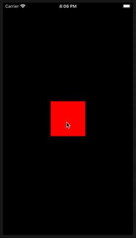

# Verketten von affinen Transformationen

## Aufgabe

<a></a>

Wir haben eine Ableitung eines `UIViews`:

```swift
class RedView: UIView {
    override init(frame: CGRect) {
        super.init(frame: frame)
        self.isUserInteractionEnabled = true
        self.backgroundColor = .red
    }
    
    required init?(coder: NSCoder) {
        fatalError("init(coder:) has not been implemented")
    }
    
    override func touchesBegan(_ touches: Set<UITouch>, with event: UIEvent?) {
        ...
    }
}
```

Wir wollen, dass alle sechs möglichen Kombinationsmöglichkeiten von 3 affinen Transformationen (Rotation um 45˚, X-Skalierung 50%, Verschiebung (x: 100, y: 200)) nacheinander durchlaufen werden, wenn auf das *View* geklickt wird.

## Ausführung

```swift
class RedView: UIView {
    override init(frame: CGRect) {
        super.init(frame: frame)
        self.isUserInteractionEnabled = true
        self.backgroundColor = .red
    }
    
    required init?(coder: NSCoder) {
        fatalError("init(coder:) has not been implemented")
    }
    
    private struct Transformations {
        var transformation = CGAffineTransform.identity
        
        var rotate: Transformations {
            Transformations(transformation: transformation.rotated(by: .pi / 4))
        }
        
        var scale: Transformations {
            Transformations(transformation: transformation.scaledBy(x: 0.5, y: 1))
        }
        
        var translate: Transformations {
            Transformations(transformation: transformation.translatedBy(x: 100, y: 200))
        }
    }
    
    private static let identity = Transformations(transformation: CGAffineTransform.identity)
    let transformations = [
        identity.rotate.scale.translate,
        identity.rotate.translate.scale,
        identity.scale.rotate.translate,
        identity.scale.translate.rotate,
        identity.translate.rotate.scale,
        identity.translate.scale.rotate,
        identity
    ].map { $0.transformation }
    
    var count = 0
    override func touchesBegan(_ touches: Set<UITouch>, with event: UIEvent?) {
        count %= transformations.count
        print(count)
        transform = transformations[count]
        count += 1
    }
}
```

## Diskussion

Die Zeile

```swift
identity.rotate.scale.translate
```

entspricht

1. Ausführungsreihenfolge rechts nach links(!):
      ```swift
      CGAffineTransform.identity.rotated(by: .pi / 4).scaledBy(x: 0.5, y: 1).translatedBy(x: 100, y: 200)
      ```

2. Ausführungsreihenfolge links nach rechts:
      ```swift
      CGAffineTransform(translationX: 100, y: 200)
                  .concatenating(CGAffineTransform(scaleX: 0.5, y: 1))
                  .concatenating(CGAffineTransform(rotationAngle: .pi / 4))
      ```

### Layer

Statt:

```swift
transform = transformations[count]
```

ginge auch:

```swift
layer.setAffineTransform(transformations[count]) // okay
```

`layer.presentation()` gibt aber nur eine Kopie des aktuell angezeigten Layers zurück. Das ginge also nicht, da wirkungslos:

```swift
layer.presentation()?.setAffineTransform(transformations[count]) // no
```

### Transform3D

Mit `CATransform3DGetAffineTransform` und `CATransform3DMakeAffineTransform` kann man zwischen `CGAffineTransform` und `CATransform3D` wechseln. Um das vorherige Beispiel mit *Transform3D* zu implementieren:

```swift
import UIKit

class ViewController: UIViewController {
    ...
}

class RedView: UIView {
    ...
    
    private struct Transformations {
        var transformation: CATransform3D
        
        var rotate: Transformations {
            Transformations(transformation: CATransform3DRotate(transformation, .pi / 4, 0, 0, 1))
        }
        
        var scale: Transformations {
            Transformations(transformation: CATransform3DScale(transformation, 0.5, 1, 1))
        }
        
        var translate: Transformations {
            Transformations(transformation: CATransform3DTranslate(transformation, 100, 200, 0))
        }
    }
    
    private static let identity = Transformations(transformation: CATransform3DIdentity)
    var transformations = [
        identity.rotate.scale.translate,
        identity.rotate.translate.scale,
        identity.scale.rotate.translate,
        identity.scale.translate.rotate,
        identity.translate.rotate.scale,
        identity.translate.scale.rotate,
        identity
    ].map { $0.transformation }
    
    ...
    override func touchesBegan(_ touches: Set<UITouch>, with event: UIEvent?) {
        ...
        layer.transform = transformations[count]
        ...
    }
}
```

Skalierung und Rotation lassen sich vielleicht so ermitteln:

```swift
extension CATransform3D {
    /// Get 2D projection of angle.
    var angle: CGFloat {
        atan2(m12, m11)
    }
    /// Get 2D projection of xScale.
    var xScale: CGFloat {
        sqrt(m11 * m11 + m12 * m12)
    }
    /// Get 2D projection of yScale.
    var yScale: CGFloat {
        sqrt(m21 * m21 + m22 * m22)
    }
}
```
